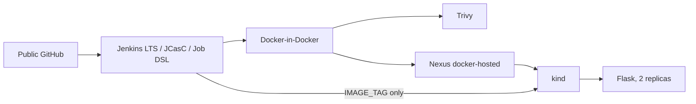

# Jenkins + Nexus + kind CI/CD Lab

An isolated, reproducible DevOps training lab for a real Jenkins CI -> Nexus -> kind CD flow. All passwords below are **TRAINING ONLY** and deliberately public; never reuse them.

## Quick start

```bash
make doctor
make up
make demo
make verify
```

Docker, Docker Compose V2, kind, kubectl, curl, jq, make and git are prerequisites. `make up` is idempotent. Use `make down` to stop services and `make reset` to remove only lab-owned containers, volumes, cluster and generated kubeconfig.

### Host access policy

`make up` detects the host OS when creating kind. On macOS it binds the application port to `127.0.0.1:8088`; on Ubuntu/Linux it binds to `0.0.0.0:8088`, so students can open `http://SERVER_IP:8088` remotely. For Linux, allow inbound TCP/8088 in the host firewall and cloud security group. Override the policy with `APP_LISTEN_ADDRESS=127.0.0.1` or `APP_LISTEN_ADDRESS=0.0.0.0` in ignored `.env`; run `make reset && make up` after changing it.

## Architecture



CI checks out source, runs the Dockerfile test target, builds one immutable image, scans it with Trivy, pushes it to Nexus, then triggers CD. CD pulls that exact image, deploys it, waits for rollout and validates `/health` plus `/version`; it does not rebuild. On a failure it attempts a rollback when a previous revision exists.

## URLs and credentials

**TRAINING ONLY — intentionally public credentials for this isolated lab.**

| Service | URL | Username | Password |
|---|---|---|---|
| Jenkins | http://localhost:8080 | admin | JenkinsLab2026! |
| Nexus | http://localhost:8081 | admin | NexusAdmin2026! |
| Nexus CI user | localhost:8082 | jenkins-ci | NexusJenkins2026! |
| Flask app | http://localhost:8088 | - | - |

## Exercises and operations

Use `make status`, `make logs`, `make demo`, and `make verify`. Break an assertion in `app/tests/test_app.py` to prove CI blocks publishing and CD. Temporarily use a bad readiness path in `k8s/deployment.yaml` to observe a CD rollout failure and rollback. Recovery is to restore the file and rerun `make demo`.

The lab intentionally uses HTTP registry access, DIND, public demo credentials, a controller executor and a single-host kind cluster. Production needs TLS, a secret manager, dedicated agents, RBAC/OIDC, managed/HA registry and Kubernetes, backups, monitoring, audit logging and webhooks. Optional extensions: SonarQube, Prometheus/Grafana, ELK and Argo CD.

See [architecture](docs/architecture.md), [student lab](docs/student-lab.md), [instructor guide](docs/instructor-guide.md), [troubleshooting](docs/troubleshooting.md), and [versions](docs/VERSIONS.md).
